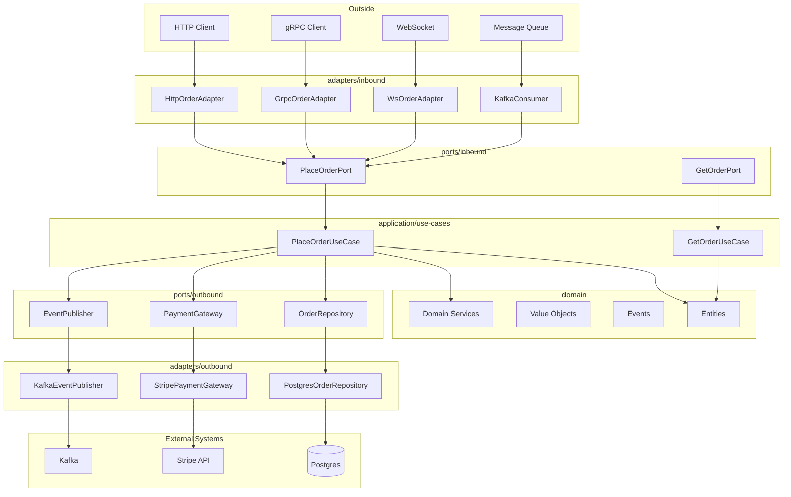

# Architecture Overview

This document explains the Hexagonal Architecture (Ports & Adapters) pattern used
in this codebase, with diagrams showing how layers relate and data flows through them.

---

## Core principle

**Business logic has zero knowledge of how it is delivered or stored.**

The domain and application layers contain all business rules. They are completely
unaware of:

- Whether the API is HTTP, gRPC, WebSocket, or CLI
- Whether data is stored in Postgres, MongoDB, or Redis
- Whether events are published to Kafka, RabbitMQ, or a webhook

This isolation is achieved through **ports** (interfaces) that define what the
application needs and what it offers, and **adapters** (implementations) that
connect those ports to real infrastructure.

---

## Layer diagram

```text
┌─────────────────────────────────────────────────────────────────────┐
│                        OUTSIDE WORLD                                │
│                                                                     │
│  [ HTTP Client ]  [ gRPC Client ]  [ WebSocket ]  [ Queue ]  [ CLI ]│
└──────────┬──────────────┬──────────────┬──────────────┬────────────┘
           │              │              │              │
           ▼              ▼              ▼              ▼
┌─────────────────────────────────────────────────────────────────────┐
│                     adapters/inbound/                               │
│  HttpOrderAdapter  GrpcOrderAdapter  WsAdapter  KafkaConsumer       │
└──────────────────────────────┬──────────────────────────────────────┘
                               │ calls inbound port
                               ▼
┌─────────────────────────────────────────────────────────────────────┐
│                      ports/inbound/                                 │
│  PlaceOrderPort   GetOrderPort   StreamEventsPort                   │
└──────────────────────────────┬──────────────────────────────────────┘
                               │ implemented by
                               ▼
┌─────────────────────────────────────────────────────────────────────┐
│                    application/use-cases/                           │
│  PlaceOrderUseCase   GetOrderUseCase   CancelOrderUseCase           │
└──────────────────────────────┬──────────────────────────────────────┘
                               │ orchestrates
                               ▼
┌─────────────────────────────────────────────────────────────────────┐
│                         domain/                                     │
│  entities/       value-objects/    events/       services/          │
│  Order, User     Money, Email      OrderPlaced   PricingService     │
└──────────────────────────────┬──────────────────────────────────────┘
                               │ uses outbound ports
                               ▼
┌─────────────────────────────────────────────────────────────────────┐
│                      ports/outbound/                                │
│  OrderRepository   PaymentGateway   EventPublisher   SessionStore   │
└──────────────────────────────┬──────────────────────────────────────┘
                               │ implemented by
                               ▼
┌─────────────────────────────────────────────────────────────────────┐
│                     adapters/outbound/                              │
│  PostgresOrderRepository   StripePaymentGateway   KafkaPublisher    │
└──────────────────────────────┬──────────────────────────────────────┘
                               │
                               ▼
┌─────────────────────────────────────────────────────────────────────┐
│                        EXTERNAL SYSTEMS                             │
│  [ Postgres ]  [ Redis ]  [ Stripe ]  [ Kafka ]  [ S3 ]            │
└─────────────────────────────────────────────────────────────────────┘

                    (wired together by infrastructure/di/)
```

---

## Dependency rule

Source code dependencies point **inward only**:

```text
infrastructure → adapters → ports → application → domain
```

- `domain` depends on nothing
- `application` depends on `domain` and `ports`
- `ports` depends on `domain`
- `adapters` depend on `ports` and `application`
- `infrastructure` depends on everything (it is the composition root)

**No arrows ever point outward.** The domain never imports from application.
The application never imports from adapters. Violations break the architecture.

---

## Data flow: placing an order

```text
1. HTTP POST /orders arrives at HttpOrderAdapter
   │
   ├─ Parses JSON body
   ├─ Validates required fields (HTTP-level validation)
   └─ Constructs PlaceOrderCommand {customerId, items}

2. HttpOrderAdapter calls PlaceOrderPort.execute(command)
   │
   └─ PlaceOrderUseCase.execute(command) runs:
      │
      ├─ Constructs domain objects: OrderId, Money, OrderItem
      ├─ Calls PricingService.calculateTotal(items) → Money
      ├─ Calls Order.construct(id, customerId, items, total)
      │    └─ Order validates invariants (not empty, etc.)
      │    └─ Order emits OrderPlaced event
      │
      ├─ Calls OrderRepository.save(order) → PostgresOrderRepository
      │    └─ Maps domain → SQL rows
      │
      └─ Calls EventPublisher.publishAll(order.events) → KafkaEventPublisher
           └─ Maps DomainEvent → Kafka message

3. PlaceOrderUseCase returns PlaceOrderResult {orderId, status, total}

4. HttpOrderAdapter maps result → HTTP 201 response {order_id, status, total}
```

---

## Why this matters in practice

### Swapping transports

Adding a gRPC endpoint requires only:

1. A new `GrpcOrderAdapter` that calls the existing `PlaceOrderPort`
2. Wiring it in `infrastructure/di/`

The domain, application layer, and all outbound adapters are unchanged.

### Swapping databases

Migrating from Postgres to MongoDB requires only:

1. A new `MongoOrderRepository` implementing `OrderRepository`
2. Updating `infrastructure/di/` to wire the new implementation

The domain, application layer, and all inbound adapters are unchanged.

### Testing in isolation

Because every dependency is behind a port, any layer can be tested with
in-memory implementations of its ports — no real database or server required.

---

## Mermaid diagram



---

## Concrete Runtime Guides

This document describes the architectural model. For the current Go implementation under `internal/`, use these companion guides:

- `docs/internal-wiring-overview.md` for the runtime composition root, router pattern, and adapter-to-use-case wiring map.
- `docs/internal-request-flow-create-user.md` for a simple request-to-persistence walkthrough.
- `docs/internal-request-flow-transaction-upload.md` for a multi-port ingestion walkthrough covering storage, persistence, queueing, and events.

Use those guides when you need the concrete request-to-persistence path, not just the abstract boundary rules.

